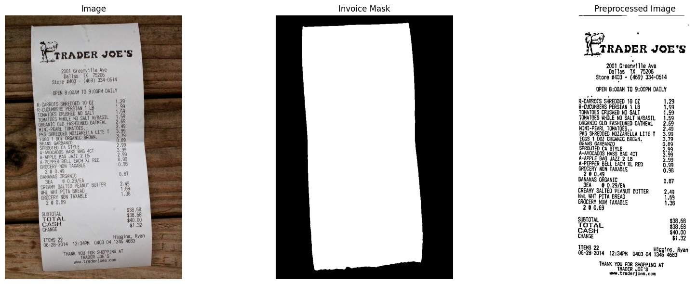

# Expense Tracker - Invoice OCR & Analysis

A powerful AI-driven expense tracking application that automatically extracts and categorizes data from invoice images using advanced OCR technology and Large Language Models (LLMs).



## ✨ Features

- **Invoice OCR**: Extract text from invoice images (PNG, JPG, JPEG, PDF)
- **AI-Powered Parsing**: Use Groq LLM to intelligently parse invoice data
- **Smart Categorization**: Automatically categorize and sum expense items
- **Image Preprocessing**: Advanced image enhancement for better OCR accuracy
- **Multiple OCR Engines**: Support for EasyOCR and PaddleOCR
- **Structured Output**: Get expense data in clean JSON format

## 🚀 Getting Started

### Prerequisites

- Python 3.8+
- Conda (recommended for environment management)

### 1. Clone the Repository

```bash
git clone https://github.com/KavinduKariyawasam/Expense-Tracker
cd Expense-Tracker
```

### 2. Set Up Environment

```bash
# Create conda environment
conda create -n expense-tracker python=3.10
conda activate expense-tracker

# Install dependencies
pip install -r requirements.txt
```

### 3. Configure API Keys

Create a `.env` file in the project root (See [.env.example](.env.example)):

```env
GROQ_API_KEY=your_groq_api_key_here
```

Get your Groq API key from [Groq Console](https://console.groq.com/).

### 4. Run the Application

#### Command Line Interface

```bash
python main.py
```

## 🤝 Contributing

Contributions are welcome! Please feel free to submit a Pull Request.

## 📞 Support

For questions or issues, please open an issue on GitHub or contact the maintainer.

---

Built with ❤️ by [KavinduKariyawasam](https://github.com/KavinduKariyawasam)